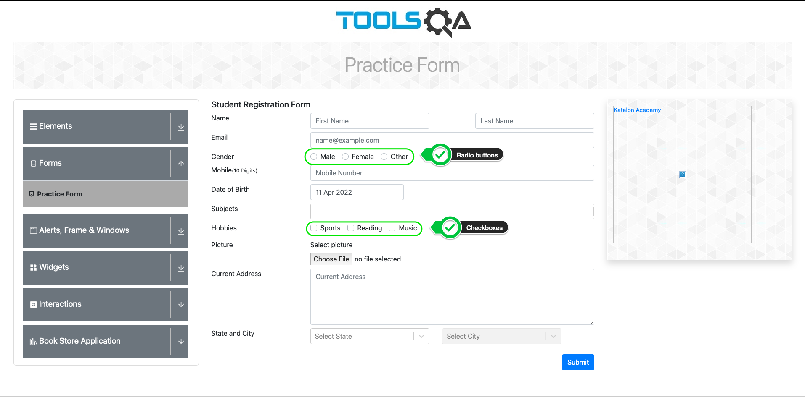
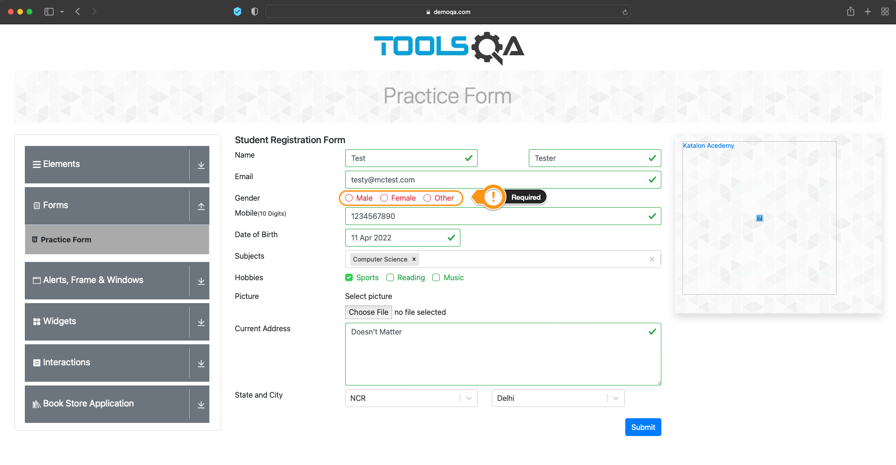
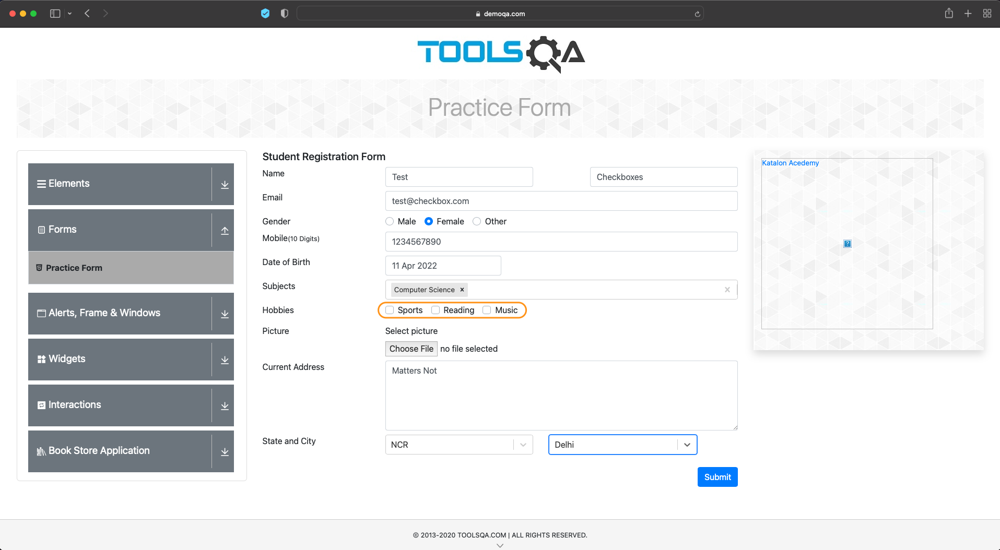
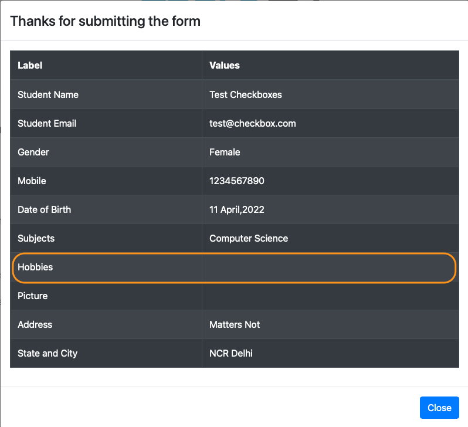

**Author**: *Guy Sinarinzi-Hay*

**Posted**: *4/11/22*

.. _report 12-SelectionAutomation:

Report 12: Selenium WebDriver - Selection Element Automation
============================================================

This report covers activities performed between 4/8/22 - 4/11/22.

.. contents:: Contents:
   :depth: 3
   :local:

.. _overview12:

Overview
--------

There are scenarios that require users to make various types of selections,
ranging from single to multiple selection options. This section covers how to
automate making selections using radio buttons and checkboxes.

We will be using a practice form from the DemoQA website for demonstration
purposes.

   DemoQA Practice Form [#f1]_

.. _radio buttons:

Radio Buttons
-------------

A radio button (🔘) is a graphical control element used for making selections.
Radio buttons are limited to choosing only one option in a given instance, i.e.:
when grouped together in a section, only one radio button option can be selected.
This property is what gives radio buttons their name: Similar to the physical
preset buttons on a old-school radio models, where only one button could remain
in a pressed position. Radio buttons are sometimes mislabelled as *radial*
buttons - it should be noted that this is a misnomer.

Radio buttons, when present, will require an option to be selected. Usually, this
means that a default option is selected, or users are prompted to make a
selection before navigating away from the page with radio buttons. Additionally,
once a radio button option is selected, clicking into the button will **not**
de-select it, users are either required to select a different radio button, or
refresh a page to have no options selected.

Therefore, when considering how to account for radio button selection in
automation, we need to check whether the button is present (displayed), enabled
(can be clicked) and/or selected (by default or user interaction).

The following command interactions can be used  to determine the status of an
element:

.. csv-table:: Element Status Command Interactions [#f2]_
   :file: ../files/se-webd-status-interactors.csv
   :widths: auto
   :header-rows: 1

To demonstrate radio button automation with the use of status command
interactions, we begin by confirming that radio buttons, when present and
enabled, will be required:

   Radio Buttons Required [#f1]_

The test script below begins by navigating to the form, entering pertinent data,
then checks whether or not the appropriate radio button selection option is
present and enabled. The radio button is then selected and an assertion confirms
that the selection was successful.

.. literalinclude:: ../../tests/test_radio_button.py
   :linenos:
   :lines: 1-70
   :emphasize-lines: 36-70
   :caption: Radio Button Selection

**Note**: From line 58 on, you may notice that we used one element to trigger
the click event, but a different element to validate that the radio button had
been selected. This is because the element that triggers the click event and the
one that registers that the radio button was selected are different. This is
seen from time to time where ReactJS dynamic components are used.

.. _checkboxes:

Checkboxes
----------

In relation to radio buttons, checkboxes (☐ , ☒ , ☑︎) are defined as graphical
widgets that allow users to select multiple options in a given instance. In
other words, where a user would only select one option for radio buttons, they
can select multiple options with checkboxes. Checkboxes are thus used in
situations where more than one option can be chosen, e.g.: *choosing all that
apply*.

While a good programmer will ensure that at least one checkbox is required (or
at least have a checkbox that accounts for "Not Applicable"), you may encounter
situations where having no checkbox required is acceptable. Additionally, unlike
radio buttons, clicking into an already-checked checkbox will undo that action,
returning the checkbox to a blank/un-checked state.

Therefore, when automating for checkboxes, it is important to be mindful of the
number of clicks performed on a box. Or, at the very least, ensure that the
``is_selected()`` boolean returns ``TRUE`` where expected.

Before we can write an automation script for checkbox validation, we should
check whether checkbox selection is required for form submission. We do this by
filling out all pertinent fields and leaving the checkboxes blank.

   Leave Checkbox Unselected [#f1]_

When we click on *Submit*, we notice that the form is submitted without any
checkbox (Hobbies) options.

   Checkbox Not Required [#f1]_

The reason it is important to know whether the checkbox options are required or
not depend upon the scenarios we automate. If you need to write a test that
ensures *Hobbies* selection options, when present, are included in the submitted
form, then your test script would need to assert that some boxes are checked
before submission.

Thus, the test script below is written to enter all pertinent fields, select
both *Sports* and *Music* hobbies, and assert whether these options are
selected.

.. literalinclude:: ../../tests/test_checkbox.py
   :linenos:
   :lines: 1-111
   :emphasize-lines: 55-111
   :caption: Checkbox Selection

.. _time spent12:

Breakdown of Time Spent
-----------------------

**Total Hours**: **13.5 hours**

* **Friday, 4-8-2022**: 2 hours
   * Researched radio button, checkbox and dropdown automation.

* **Saturday, 4-9-2022**: 3 hours
   * Added documentation for radio buttons.
   * Added documentation for checkboxes.
   * Continued research for dropdown automation.

* **Sunday, 4-10-2022**: 2 hours
   * Added more radio button and checkbox documentation.

* **Monday, 4-11-2022**: 6.5 hours
   * Added test script for radio buttons.
   * Added test script for checkboxes.
   * Cleaned up documentation and checked for spelling errors.
   * Reviewed report with Dr. Craven.
   * Made some changes based on feedback from Dr. Craven.
   * Pushed code to GitHub.

.. _references12:

References
----------

* `Link to test cases on GitHub <https://github.com/haybgq/cis385/tree/main/tests>`_
* `Link to element status interaction documentation <https://selenium-python.readthedocs.io/api.html#selenium.webdriver.remote.webelement.WebElement.is_selected>`_

.. rubric:: Footnotes:
.. [#f1] DemoQA. (n.d.). Practice Form. ToolsQA. Retrieved April 10, 2022, from https://demoqa.com/automation-practice-form
.. [#f2] Selenium. (2011). Selenium Remote WebDriver.
   Retrieved April 10, 2022, from https://selenium-python.readthedocs.io/api.html#selenium.webdriver.remote.webelement.WebElement.is_selected
