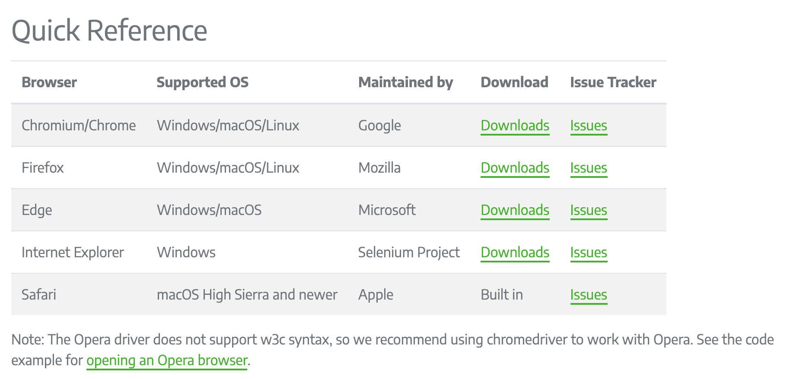

**Author**: *Guy Sinarinzi-Hay*

**Posted**: *1/28/22*

Report 2: Browser Drivers
=========================

This report covers activities performed between 1/20/22 - 1/28/22. The main
focus for this period is centered around Browser Driver functionality. Topics
covered include:

* Browser Driver Definition
* Browser Driver Configuration
* Example Test Cases

.. _definition:

Definition
----------

In :ref:`Setup <setup>`, we outlined the Selenium WebDriver :ref:`architecture <selenium webdriver>`
which showed the browser driver as the connector between the automation script
and the browser. With this in mind, the browser driver can be defined as a
program that interacts with the browser, relays instructions from an automation
script, fetches those results and relays them back to the automation
script. The browser driver performs its tasks as follows:

#. The automation script is converted into a JSON file that is transmitted to
   the browser driver via Wire Protocol over HTTP.
#. The browser driver parses the JSON file, reads the commands, then establishes
   a secure connection to the browser and proceeds to execute commands in the
   browser via the HTTP Server.
#. The browser then relays the execution status response to the browser driver
   over HTTP Server.
#. The browser driver converts the status response into a JSON file and relays
   it back to the automation script via Wire Protocol over HTTP.

Selenium currently supports the following browsers:

   Supported Drivers [#f1]_

The link to download these drivers can be found in `References`_.

.. _configuration:

Configuration
-------------

To successfully launch a browser via automation, we need to import the
``webdriver`` attribute and create a WebDriver instance that launches the
browser. This is performed using the following commands in Python:

.. code-block:: Python

    # Import WebDriver
    from selenium import webdriver

    # Launch Chrome Browser
    driver = webdriver.Chrome()

However, for this to work, the browser driver needs to be downloaded and
configured appropriately. There are 3 methods that can be used to configure
and utilize browser drivers:

.. _path directory:

1. Store Driver in PATH Directory
^^^^^^^^^^^^^^^^^^^^^^^^^^^^^^^^^

The quickest and most flexible method consists of downloading the appropriate
browser driver binary file, unzipping the contents and storing it in any
given directory specified by ``PATH``.

``PATH`` is an environment variable that sets/specifies directories where
executable programs are stored. To determine which local directories are stored
on ``PATH``, we can use the following command in Terminal:

.. code-block:: Shell

   # Mac/Linux
   echo $PATH

   # Windows
   echo %PATH%

As long as the driver file is stored in a directory listed in path, the script
will pick it up at execution. Below is an example test case that runs with
browser driver is stored in ``PATH``:

.. literalinclude:: ../../tests/test_driver_in_path.py
   :linenos:
   :caption: Script for Driver in PATH

The benefit of using this option is that it eradicates the need to write or
update code to account for driver location.

.. _specify directory:

2. Specify Driver Location
^^^^^^^^^^^^^^^^^^^^^^^^^^

In instances where we need to have an added measure of control on where our
drivers are pulled from, we can specify location in the script. The example
below demonstrates a test case where the driver location has been assigned a
variable, then pulled when it is time to launch browser:

.. literalinclude:: ../../tests/test_driver_location_specified.py
   :linenos:
   :caption: Script for Driver Location Specified

An added benefit of using this option is it reduces the amount of time one may
spend determining Environment Variables, especially if they are using a shared
drive.

.. _driver manager:

3. Driver Manager
^^^^^^^^^^^^^^^^^

Whether we store our browser drivers in :ref:`PATH <path directory>` or a
:ref:`Specified Location <specify directory>`, when the browser gets updated, we
will be forced to update our drivers as well. Browser updates are automatic on
most machines, however, driver updates not. The repetitiveness of manually
downloading and updating drivers can be exhaustive. A viable solution would be
to install a WebDriver Manager that checks for and updates your drivers whenever
updates come out.

To do this, we need to install the ``webdriver-manager`` package, and import the
appropriate module for your browser driver as follows:

.. code-block:: Python

    # Install WebDriver Manager Package
    pip install webdriver-manager

    # Import ChromeDriverManager
    from webdriver_manager.chrome import ChromeDriverManager

From then on, anytime a script is ran after a browser update, the Driver Manager
will handle driver updates, if any are required. Below is an example test case
with Driver Manager code:

.. literalinclude:: ../../tests/test_driver_manager.py
   :linenos:
   :caption: Script for Driver Manager Test

.. _time spent:

Breakdown of Time Spent
-----------------------

**Total Hours**: **11.5 hours**

* **Friday, 1-21-2022**: 1 hour
   * Setup initial documentation for Report 2.
   * Researched Browser Drivers.

* **Thursday, 1-27-2022**: 3 hours
   * Coded test scripts with PATH.
   * Added additional notes to Report 2 Definition section.

* **Friday, 1-28-2022**: 7.5 hours
   * Created Report 2 Configuration section.
   * Researched how to specify driver location and use driver manager.
   * Coded test script for specifying driver location.
   * Added code for driver manager logic.
   * Cleaned up and formatted Report 2 documentation.
   * Pushed all changes to GitHub.

References
----------

* `Code <https://github.com/haybgq/cis385>`_
* `Drivers <https://www.selenium.dev/documentation/webdriver/getting_started/install_drivers/#quick-reference>`_

.. rubric:: Footnotes:
.. [#f1] Selenium. (2022, January 12). Install browser drivers. Selenium.
   Retrieved January 28, 2022, from https://www.selenium.dev/documentation/webdriver/getting_started/install_drivers/#quick-reference