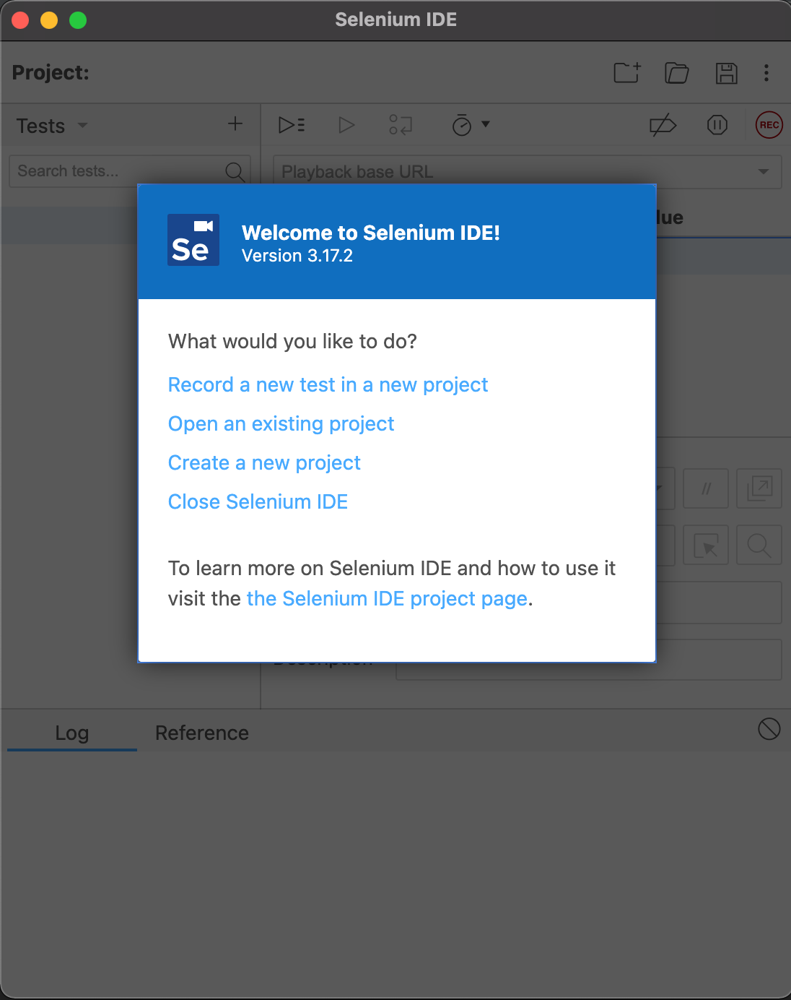
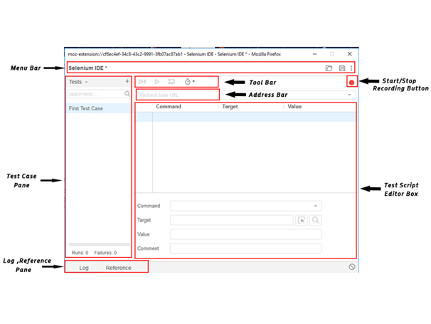

**Author**: *Guy Sinarinzi-Hay*

**Posted**: *2/10/22*

Report 5: Selenium IDE
======================

This report covers activities performed between 2/7/22 - 2/10/22. In the last
four reports, we have covered Selenium WebDriver capabilities. This section
explores the Selenium IDE test tool, covering the following topics:

* Overview
* Installation
* Components
* First Test Case

.. _overview5:

Overview
--------

The Selenium Integrated Development Environment, commonly referred to as
Selenium IDE, SeIDE or SIDE, is a component of the Selenium suite that is used
for web automation. As noted in the :ref:`architecture <selenium ide>` diagram,
Selenium IDE is launched via a browser extension with a Graphical User Interface
(GUI) that allows users to record, edit, and run automation scripts
(playback feature) in the browser.

Advantages
^^^^^^^^^^

* Requires little to no technical knowledge to install and use:

   * SIDE can be added to the browser as an extension in a matter of seconds.

* The easy-to-use GUI of SIDE removes the need for programmatic automation:

   * Unlike WebDriver which requires programming literacy, tests can be created
     and maintained in the GUI, and still allow users to use advanced logic such
     as adding looping, assertions or control flow (if-else logic).
   * The record-and-playback feature allows the SIDE tool to automatically find
     elements on its own rather than the user manually determining which :ref:`locators <locator strategies>`
     to use - a process that can be  time consuming.

* Includes a code export feature:

   * Should the need arise, tests can be exported in several programming
     languages and test frameworks (such as :ref:`pyTest <pytest>` for Python).

* Allows for control of test run speed:

   * When a test is being ran/played back, controlling the speed at which it
     runs makes it easy for users to follow what is happening. This capability
     is not available in WebDriver, for instance, and most users can barely keep
     up when the automation script is ran in the browser.

Disadvantages
^^^^^^^^^^^^^

* Only available in Chrome, Edge, and Firefox.

   * While Selenium IDE is actively maintained, the support for more browsers is
     currently still limited.

* Maintaining scripts can be taxing:

   * The larger the script, the longer it takes to update or maintain it when
     elements on a page are changed.

.. _installation:

Installation
------------

Selenium IDE is available as a browser extension and can be installed following
the instructions in the the ``readme.rst`` file on `GitHub <https://github.com/haybgq/cis385/blob/main/readme.rst>`__.

.. literalinclude:: ../../readme.rst
   :language: rst
   :lineno-start: 56
   :lines: 56-74
   :caption: readme.rst

By the end of the installation, we should be able to launch and see SIDE display
as shown in the image below:

     Launch Selenium IDE

.. _components:

Components
----------

Selenium IDE has numerous components that are used for various purposes. The
most commonly-used features are listed in the table and figure below:

.. csv-table:: Selenium IDE Components table [#f1]_
   :file: ../files/se-ide-components.csv
   :widths: auto
   :header-rows: 1

   Selenium IDE Components figure [#f1]_

.. _side first test case:

First Selenium IDE Test Case
----------------------------

Scenario:
^^^^^^^^^

Launch Chrome browser, navigate to Google, search for "Paul Vincent Craven",
then access the returned results.

Selenium IDE Record Test:
^^^^^^^^^^^^^^^^^^^^^^^^^

After launching Selenium IDE by clicking on the browser extension, create a new
test in a new project. Assign a project name, then set the base URL to Google
and start recording. Execute the outlined scenario, and stop recording when
done. Assign a name to the recorded test case.

.. raw:: html

    <em>Record Test Demo</em>
    

    <video width="320" height="240" controls src="../_static/videos/se-ide-record.mov">
        Your browser does not support the video tag.
    </video>

Selenium IDE Run Test:
^^^^^^^^^^^^^^^^^^^^^^^^^

Once the test is recorded, and saved, users can run it any number of times by
clicking the "Run" button. This can be seen in the Run Test demo file below:

.. raw:: html

    <em>Run Test Demo</em>
    

    <video width="320" height="240" controls src="../_static/videos/se-ide-playback.mov">
        Your browser does not support the video tag.
    </video>

Selenium Projects:
^^^^^^^^^^^^^^^^^^

Selenium IDE projects, when saved, are assigned ".side" extension and stored in
JSON format, as seen below:

.. literalinclude:: ../../tests/cis-385-Selenium-IDE-Tests.side
   :language: json
   :linenos:
   :caption: Selenium IDE Test File

.. _time spent5:

Breakdown of Time Spent
-----------------------

**Total Hours**: **11 hours**

* **Tuesday, 2-8-2022**: 1 hour
   * Setup initial documentation for Report 5.

* **Wednesday, 2-9-2022**: 5 hours
   * Researched Selenium IDE functions and capabilities.
   * Added notes to page.

* **Thursday, 2-10-2022**: 5 hours
   * Added Selenium IDE installation and components sections to Report 5.
   * Record Selenium test case and attached screen recordings to Report 5.
   * Demoed work to Dr. Craven.
   * Made updates based on Dr. Craven's feedback.
   * Pushed all changes to GitHub.

References
----------

* `Link to the code on GitHub <https://github.com/haybgq/cis385>`_
* `Link to Selenium IDE Documentation <https://www.selenium.dev/selenium-ide/docs/en/introduction/getting-started/>`_

.. rubric:: Footnotes:
.. [#f1] JavaTpoint. (2021, November 15). Selenium IDE-Features.
   www.javatpoint.com. Retrieved February 10, 2022, from https://www.javatpoint.com/selenium-ide-features
