**Author**: *Guy Sinarinzi-Hay*

**Posted**: *2/19/22*

.. _report-6:

Report 6: Selenium IDE - Control Flow
=====================================

This report covers activities performed between 2/14/22 - 2/19/22. As mentioned
in the previous section, Selenium IDE does not require programming literacy.
It does, however, possess commands (also known as *Selenese*) that can be
leveraged by the more technical users to handle complex scenarios.

.. contents:: Contents:
   :depth: 3
   :local:

.. _overview6:

Overview
--------

Control Flow involves the use of commands that are executed when a set of
conditions are met. These commands can also be executed repeatedly depending on
a given scenario.

.. _conditional logic:

Conditional Logic
-----------------

Commonly referred to as Conditional Branching, it allows for a change in
behavior based on given conditions.

Commands:
^^^^^^^^^

The control flow commands for conditional logic include: ``if``, ``else if``
, ``else`` and ``end``

* **If**:
   * Opening command of a conditional block.
   * It evaluates a JavScript expression for ``true`` or ``false``.
   * If expression is true, the rest of the block is ran until the
     next conditional command.

* **Else If**:
   * Final condition in an ``if`` block.
   * If none of the previous conditions are met, this command will be executed.

* **Else**:
   * If expression is true, the rest of the test until the next conditional
     command.

* **End**:
   * Terminates the conditional command block, allowing the test to resume
     activities outside of the block.

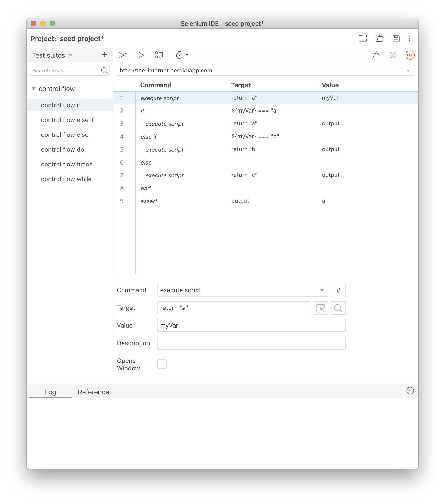

   Conditional Logic [#f1]_

.. _looping logic:

Looping Logic
-------------

Allows for the iteration of a given set of commands depending on the scenario.

Commands:
^^^^^^^^^

The control flow commands for looping logic include: ``while``, ``do``
, ``forEach`` and ``times``

* **While**:
   * Begins by JavaScript expression for ``true`` or ``false``.
   * If expression is ``true``, the rest of the block is ran until the ``end``
     command is reached. The test then returns to ``while`` command and repeats
     the process until the expression is evaluated as ``false``.
   * The loop will continue to run until the expression is returned false, or an
     infinite loop protection is triggered.
   * If expression is ``false``, the rest of the entire ``while`` block is
     skipped and the test continues.

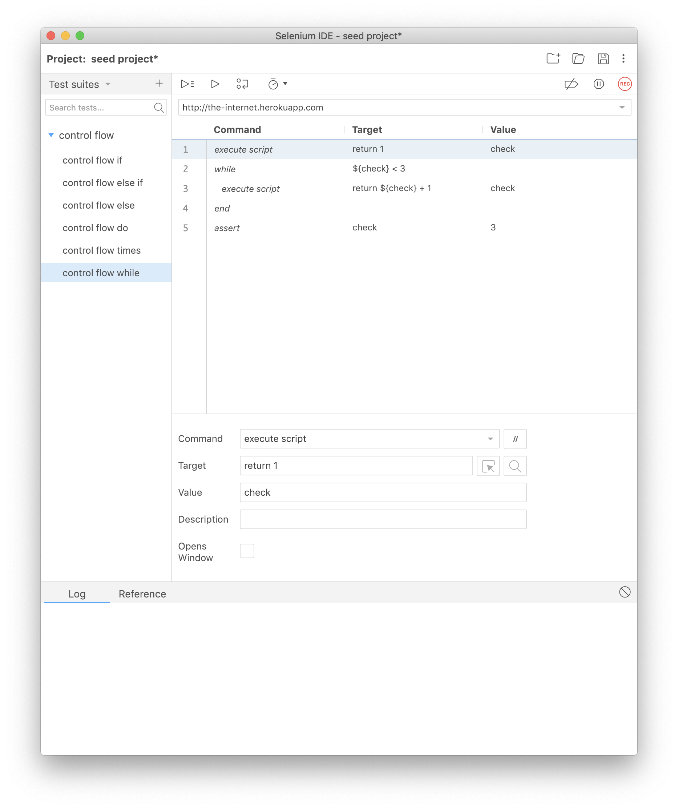

   While Command [#f2]_

* **Do**:
   * Accompanied by a ``repeat if`` command that evaluates the expression as
     ``true`` or ``false``.
   * The ``do`` command will execute first, running through the code block, and
     then evaluates whether ``true`` or ``false`` at the end of the block.
   * The loop will continue to run until ``repeat if`` evaluates ``false``.

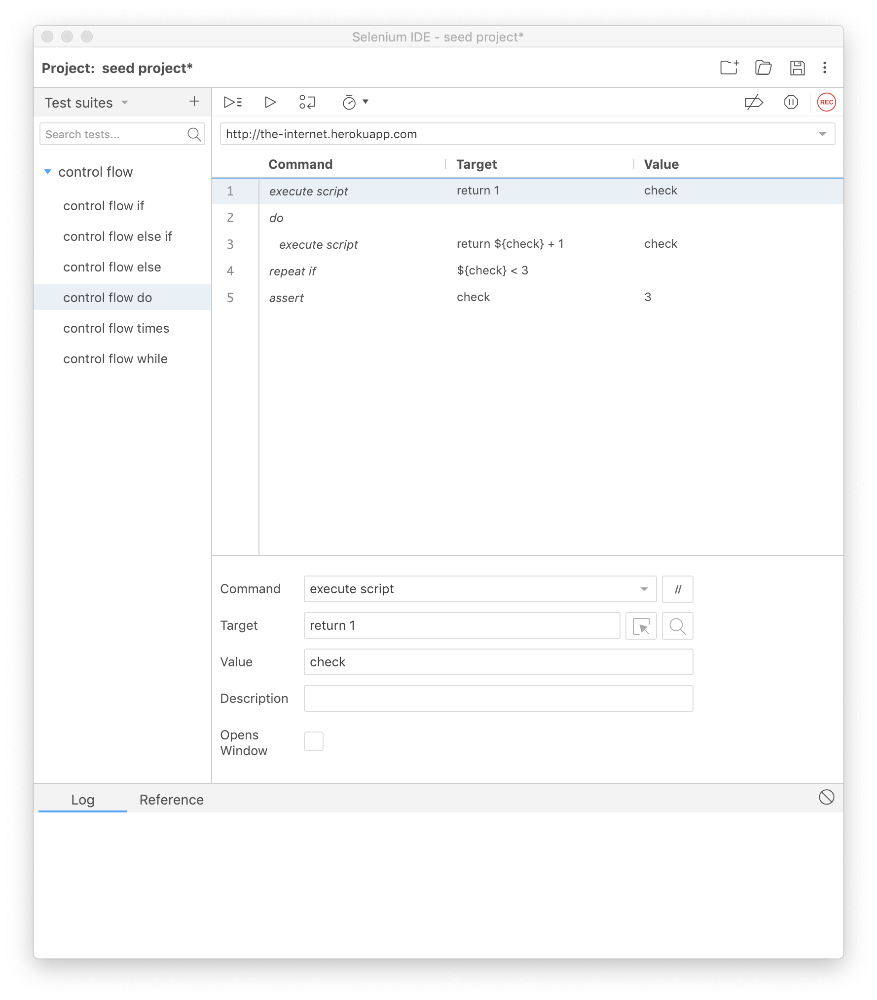

   Do Command [#f3]_

* **ForEach**:
   * Allows iteration over a collection, such as an array, and references each
     item in the collection.
   * Loops through the code block for every instance of the the contents in the
     array.
   * Stops when it encounters the ``end`` command, and then returns to
     ``forEach`` and checks for contents in the collection.
   * In the programming world, ``forEach`` commands is essentially a ``for``
     loop.

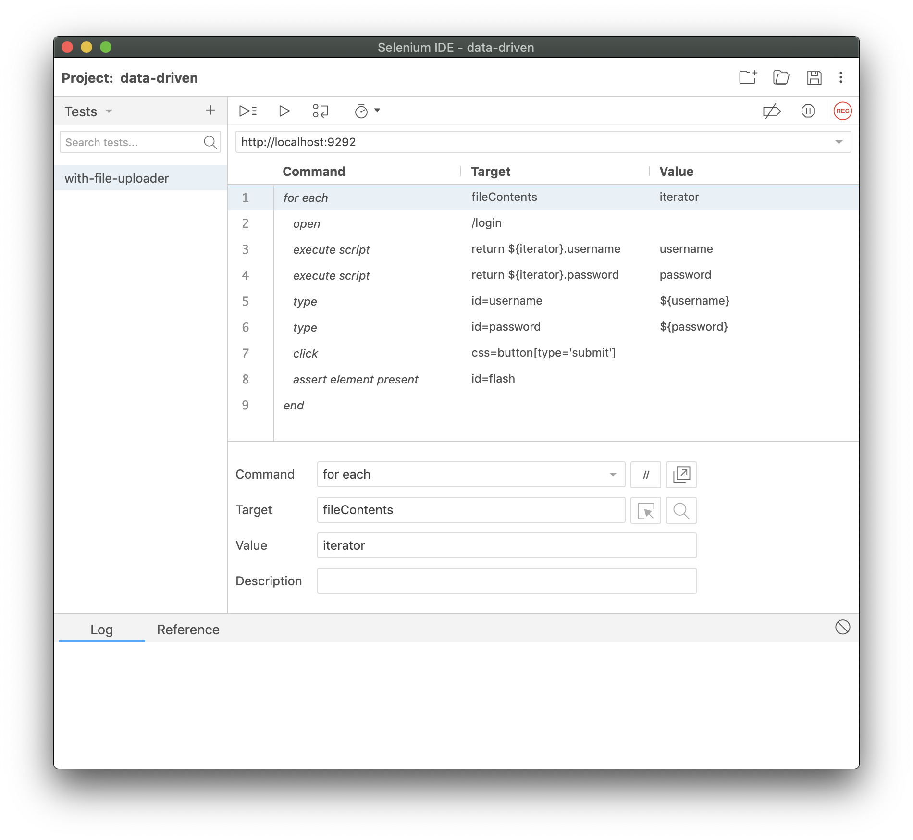

   ForEach Command [#f4]_

* **Times**:
   * Specifies number of times a set of commands can be ran.
   * Depends on the ``end`` command to close.

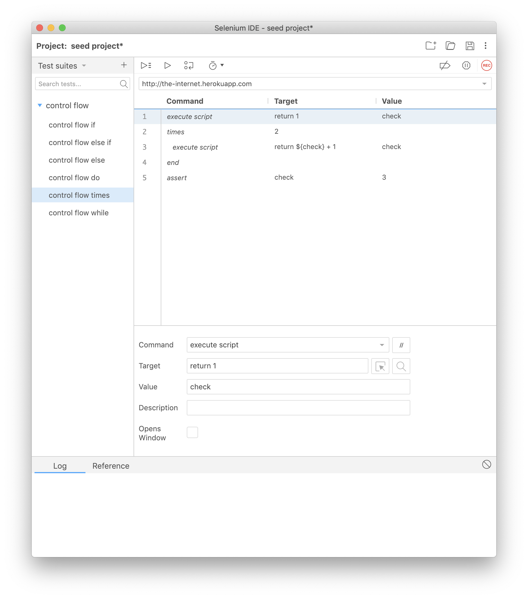

   Time Command [#f5]_

Test Case
---------

Scenario
^^^^^^^^

Imagine we wanted to automate the process of checking whether an Instagram
(IG) username was available for use. We would do this by writing (or recording)
a basic test case that:

1. Navigates to the IG Username Generator website.
2. Enters the username (example: *guy*).
3. Clicks on a button to check whether the name is available.
4. Validates (asserts) that we receive a response confirming the username's
   availability.

The :ref:`Test-UserName-Generator <test-username-generator>` test case below
shows demonstrates this scenario:

.. _test-username-generator:

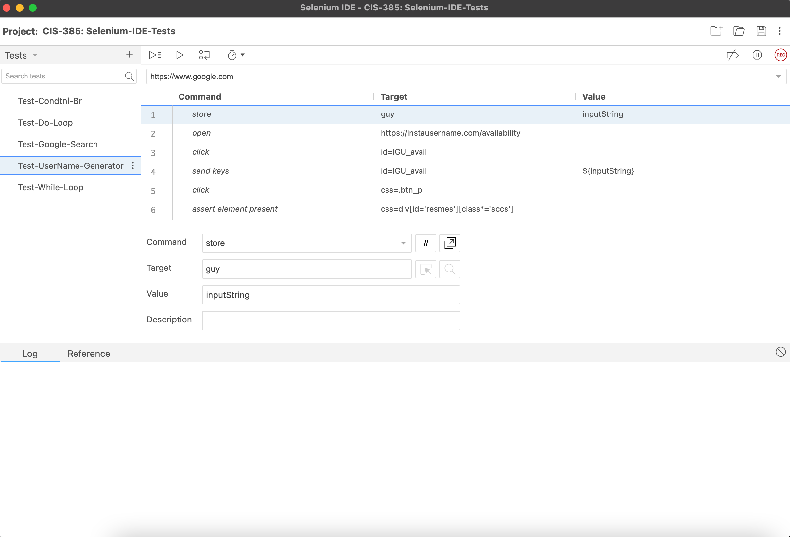

   Test-UserName-Generator

As we run the test, we would soon realize it has a major flaw, i.e.: *If the
very first username we entered was not available, then the test case would fail.*

.. _test-username-generator-failed:

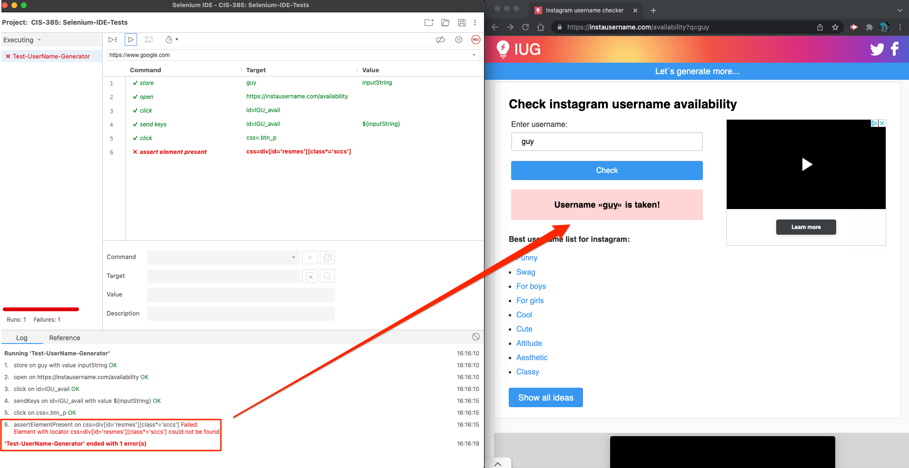

   Test-UserName-Generator-Failed

However, we are expert QA Automation Engineers, therefore, we *know* that the
solution to this problem lies with control flow logic. Still, the question
remains, which type of control flow logic would address our problem? To
determine this, we begin thinking through the problem:

.. _conditional solution:

::

 # Thought Process
 ## Problem:
 Automation script fails if the username already exists. We need a way to
 account for this scenario.

 ## Solution:
 1. Let the script run a happy path, i.e.: assert username is available.
 2. But, if the username already exists, modify the username entry and run the
    script again.

The keyword "if", along with the recommended change in script behavior when a
condition is not met, leads us to conclude that we need to apply conditional
logic.

.. _conditional:

Conditional Solution
^^^^^^^^^^^^^^^^^^^^

Updating the existing test case to apply conditional logic would mean:

1. Adding a variable ``iterator`` that will be concatenated to our existing
   username variable ``inputString``, in the event our username already exists.
   This is seen in Step 2 of the :ref:`Test-Condtnl-Br <test-condtnl-br>` test
   case below.
2. Adding a variable ``isAvailable`` that stores the number of instances where
   the username is available. See steps 7-8 below.
3. Adding ``if`` command with conditional logic that evaluates whether the
   username is not available, and if the condition is met, proceeds to execute a
   block that adds the ``iterator`` variable to our username ``inputString`` and
   checks if the username exists. See steps 9-13 below.

.. _test-condtnl-br:

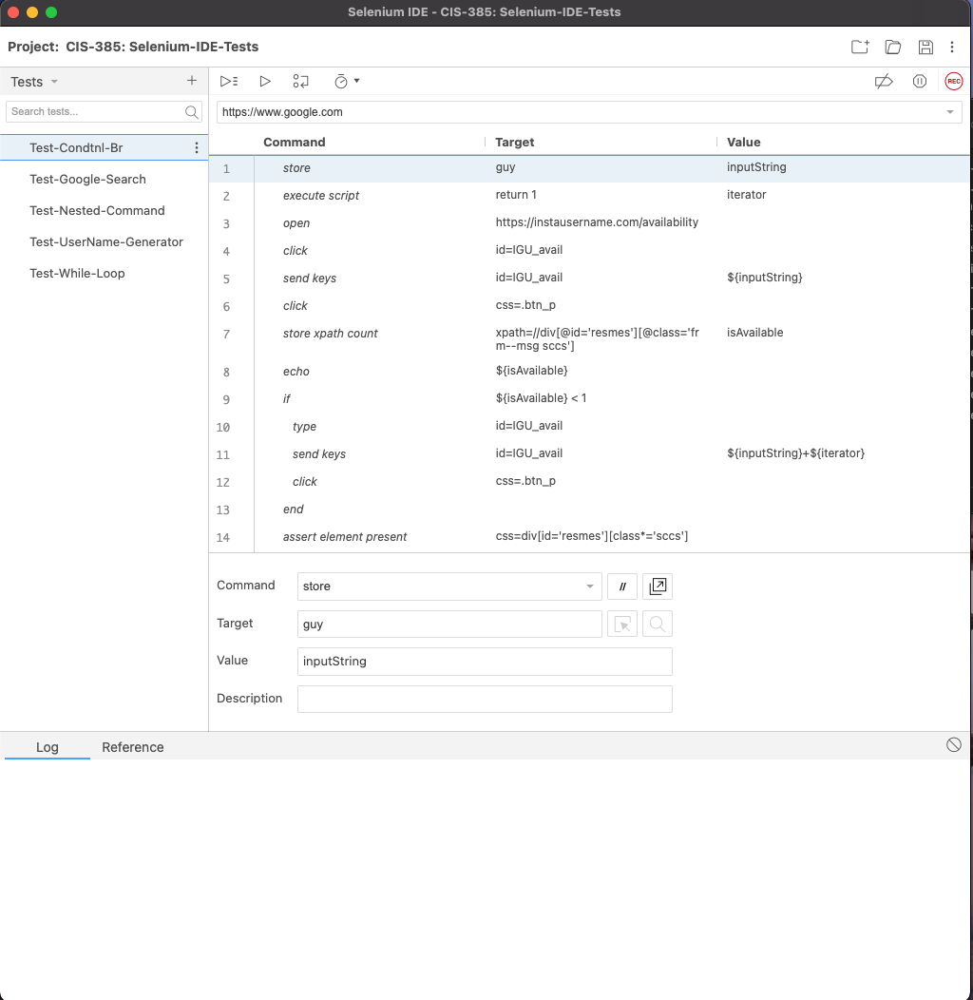

   Test-Condtnl-Br

Running our updated test case, we end up seeing another failed result as seen
below:

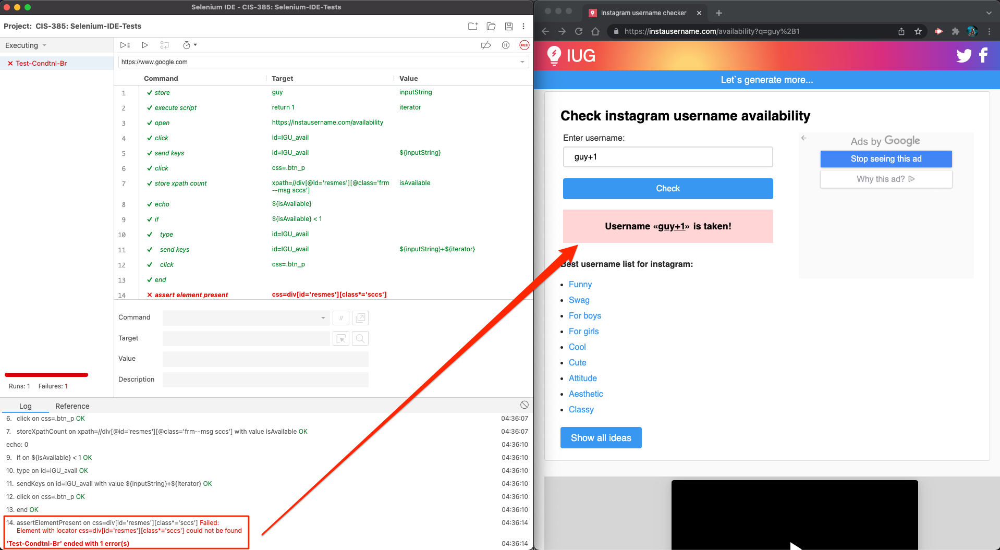

   Test-Condtnl-Br-Failed

Notice, that while the test case failed, the reason for failure is slightly
different reason than seen in the :ref:`Test-UserName-Generator-Failed <test-username-generator-failed>`
test case, namely:

1. The failed username (guy+1) is different.
2. In step 5, we passed the username "guy", then in steps 7 and 8, we had no
   instances of that username being available. So, the expression in step 9 was
   satisfied, and the username was updated to "guy+1".

At this point, we have come to the realization that even though we accounted for
a case where our initial username (guy) was not available, if the updated
username is also not available, then test will fail as well. Conditional logic
blocks, while ideal, can only be ran through *once*. This limitation brings us
to the conclusion that we need to apply looping logic, so we may iterate through
a few usernames until we find one that is available for use. Going back to the
drawing board, we need to think through *which* type of looping logic we will
need to apply:

.. _looping solution:

::

 # Thought Process
 ## Problem:
 Script updates user name only once, and then fails if new username is not
 available. We need to keep trying different usernames until we find one that is
 available.

 ## Solution:
 1. Use the while command to first evaluate whether username is not available,
    then loop through the code block until we find one that is available.
 2. Use the do command to run a code block first, then evaluate whether username
    is not available, and repeat if the username is not available.

.. _looping:

Looping Solution
^^^^^^^^^^^^^^^^

We opted to go with the ``while`` command, as it evaluates first, and then
loops only if necessary. The difference between the ``do`` and ``while``
commands is that the ``do`` loop will run at least once, whereas the ``while``
loop may not run at all depending on whether the situation requires it. For our
scenario, we only want to run a loop if the initial username we entered is not
available.

The :ref:`Test-While-Loop <test-while-loop>` test case has been updated to show:

1. A ``while`` command that evaluates whether the username is not available,
   and if the condition is met, proceeds to execute a block that adds the
   ``iterator`` variable to our username ``inputString`` and checks if the
   username exists. See steps 9-12.
2. The ``isAvailable`` variable then stores and displays the number of instances
   where the username is available. See steps 13-14.
3. A snippet of JavaScript is then ran to increment the ``iterator`` variable.
   This way, if the loop is ran again, a new value of  ``iterator`` is
   concatenated to the username ``inputString`` variable. See step 15.

.. _test-while-loop:

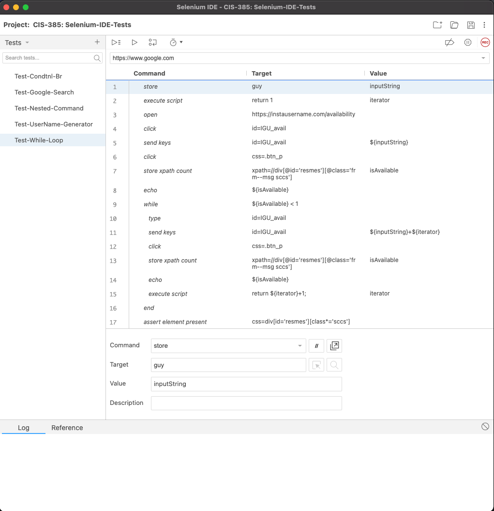

   Test-While-Loop

We run the test with a username that is not available (*guy*) to ensure that it
works the way we want it to, i.e.: *It keeps looping until it finds a username
that is available.* **Result: Passed**

.. _test-while-loop-w-existing-username:

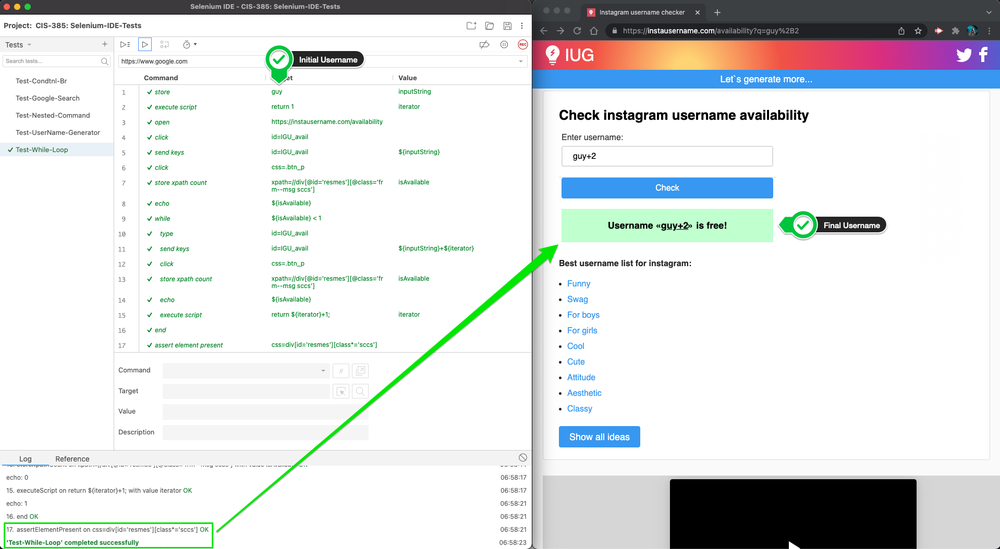

   Test-While-Loop-With-Existing-Username

Then, we run the test using an available username (*guy+2*) to ensure that the
loop is *skipped*, since the username is available. **Result: Passed**

.. _test-while-loop-w-available-username:

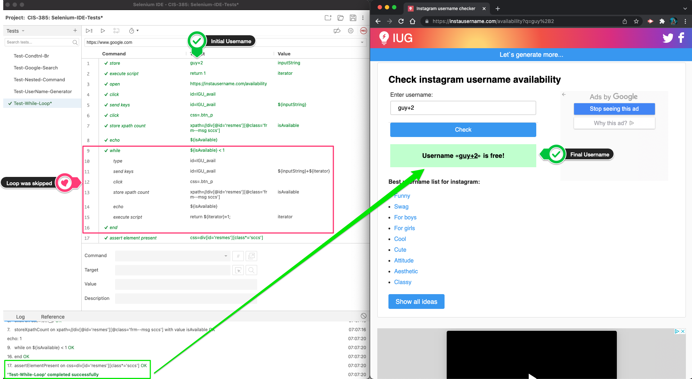

   Test-While-Loop-With-Available-Username

.. _nested:

Nested Solution
^^^^^^^^^^^^^^^

It should be noted that commands can be nested as well. The
:ref:`Test-Nested-Command <test-nested-command>` test case  shows a  ``do``
command nested within an ``if`` command. See steps 9-18 below:

.. _test-nested-command:

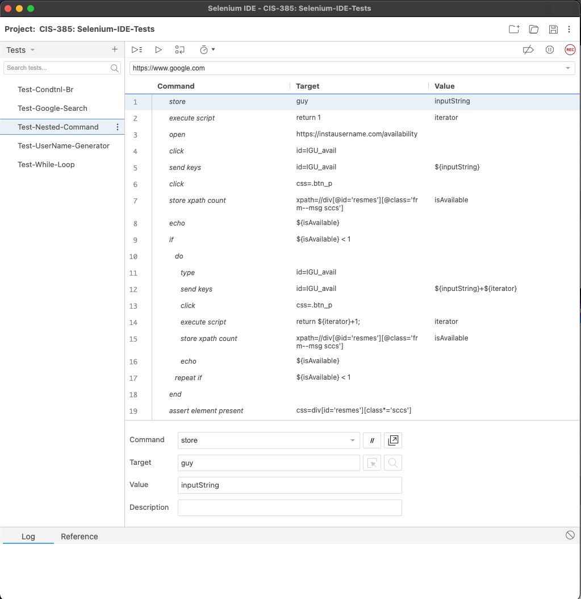

   Test-Nested-Command

Should the expression in the ``if`` block evaluate as ``true``, then the ``do``
loop will be executed as seen below:

.. _test-nested-command-executed:

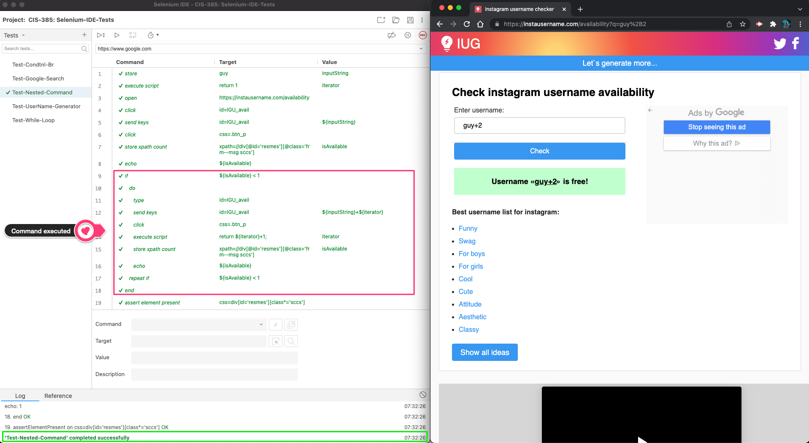

   Test-Nested-Command-Executed

Should the expression in the ``if`` block evaluate as ``false``, then the ``do``
loop will be skipped as seen below:

.. _test-nested-command-skipped:

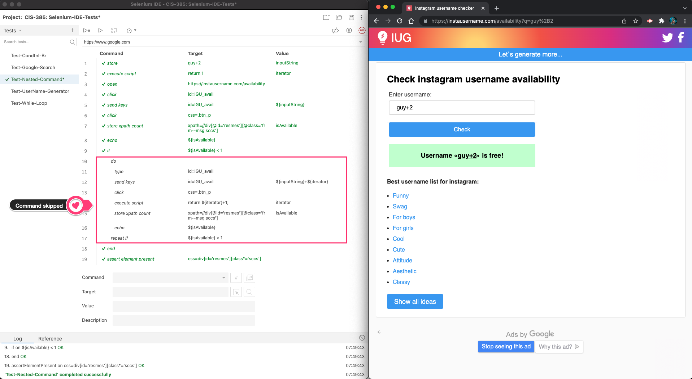

   Test-Nested-Command-Skipped

Conclusion
^^^^^^^^^^

While it could be said that both the :ref:`Looping <looping>` and :ref:`Nested <nested>`
solutions work, when determining the ideal test case, we must consider:

1. **Relevance**: Both test cases are relevant.
2. **Verbosity**: The Nested solution has more steps than the Looping solution.
3. **Maintainability**: Due to greater verbosity and more expressions to
   evaluate, the Nested solution requires greater
   maintenance bandwidth.
4. **Performance**: The Looping solution runs faster due to fewer expressions to
   evaluate.

We would prefer to use the Looping solution over the Nested solution for the
outlined reasons.

.. _references6:

References
----------

* `Link to test cases on GitHub <https://github.com/haybgq/cis385/blob/main/tests/cis-385-Selenium-IDE-Tests.side>`_
* `Link to Control Flow Documentation <https://www.selenium.dev/selenium-ide/docs/en/introduction/control-flow>`_

.. rubric:: Footnotes:
.. [#f1] Selenium. (2019, June 3). Control flow · selenium ide. Selenium IDE.
   Retrieved February 18, 2022, from https://www.selenium.dev/selenium-ide/docs/en/introduction/control-flow#conditional-branching
.. [#f2] Selenium. (2019, June 3). Control flow · selenium ide. Selenium IDE.
   Retrieved February 18, 2022, from https://www.selenium.dev/selenium-ide/docs/en/introduction/control-flow#while-selenium-ide-docs-en-api-commands-while
.. [#f3] Selenium. (2019, June 3). Control flow · selenium ide. Selenium IDE.
   Retrieved February 18, 2022, from https://www.selenium.dev/selenium-ide/docs/en/introduction/control-flow#do-selenium-ide-docs-en-api-commands-do
.. [#f4] Selenium. (2019, June 3). Control flow · selenium ide. Selenium IDE.
   Retrieved February 18, 2022, from https://www.selenium.dev/selenium-ide/docs/en/introduction/control-flow#foreach-selenium-ide-docs-en-api-commands-for-each
.. [#f5] Selenium. (2019, June 3). Control flow · selenium ide. Selenium IDE.
   Retrieved February 18, 2022, from https://www.selenium.dev/selenium-ide/docs/en/introduction/control-flow#times-selenium-ide-docs-en-api-commands-times