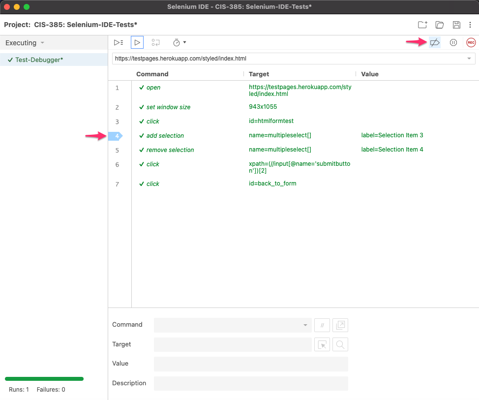

**Author**: *Guy Sinarinzi-Hay*

**Posted**: *2/25/22*

Report 7: Selenium IDE - Advanced
=================================

This report covers activities performed between 2/21/22 - 2/25/22. Selenium IDE
possesses an arsenal of tools that help bridge the gap between those who prefer
to program and those who would rather rely on the GUI. This section explores
that bridge and covers the following topics:

* Debugging
* Command-Line Runner
* Exporting Code

.. _debugging:

Debugging
---------

Debugging is the process of identifying and fixing errors encountered in a test
script. In Selenium IDE, the debugging process consists of adding breakpoints
and pausing the test when a given breakpoint is reached, so we may inspect the
root cause of failure.

To demonstrate the debugging process, we shall use the :ref:`Test-Debugger <test-debugger>`
script below, which failed at Step 4.

.. _test-debugger:

   Test-Debugger

.. _add breakpoint:

We begin our debugging by adding a breakpoint to the failed step. This can be
done in one of three ways, as shown below:

1. Right-clicking on the failed step and selecting *Toggle breakpoint*, or
2. Selecting the failed step and pressing the *"B"* shortcut on the keyboard, or
3. Clicking on the step number (4).

   Toggle Breakpoint

Once the breakpoint is added, the selected step number is highlighted in blue,
as shown below:

   Added Breakpoint

Click on the *Run current test* (▶️) button, and observe that the following
occurs:

1. The execution was paused when the breakpoint was reached.
2. The breakpoint/step for which the execution was paused is highlighted.
3. The browser where the test is being ran can be seen, since the test was.
   *Normally, the browser would have closed when the step failed, and an
   exception would have been thrown in the log.*

   Paused in Debugger

Expert troubleshooters that we are, we have recognized the root cause of our
issue, i.e.: *We were looking for a Selection Item (5) that does not exist!*
After resolving this issue (by changing the selection item number to an existing
value), we can:

1. Click on *Step over the current command*, and
2. Confirm that the step passes validation, as shown below:

   Step Over Current Command

Once we are confident that the issue was resolved, we can resume the test
execution without pause by clicking on the pause (⏸) icon and letting
the rest of the script run its course.

   Resume Execution

Users have the ability to disable all breakpoints. When this option is selected,
all breakpoint icons will be displayed in a lighter shade, as shown below:

   Disable Breakpoints

Toggle the breakpoint off by repeating the :ref:`same steps <add breakpoint>` we
took to add it. Once removed, the blue arrow will disappear from the selected
step, as shown below:

   Breakpoint Removed

.. _command-line runner:

Command-Line Runner
-------------------

The Selenium IDE Command-Line Runner, also known as ``selenium-side-runner``, allows
users to run their Selenium IDE tests in parallel within the command line on a
NodeJS platform.

.. _cli-installation:

Follow the steps below from the ``readme.rst`` file on `GitHub <https://github.com/haybgq/cis385/blob/main/readme.rst>`__
to complete installation:

.. include:: ../../readme.rst
  :start-line: 76
  :end-line: 117

**Note**: Step 3 can be ignored if you have been following along, since we would
have installed all pertinent drivers in :ref:`Browser Drivers <report 3-Browser Drivers>`.

Launching SIDE Runner
^^^^^^^^^^^^^^^^^^^^^

When the installation steps have been completed, launch command line and enter
the command below, followed by the directory to your ``.side`` project folder:

.. code-block:: Shell

   > selenium-side-runner /path/to/project.side

Once the command is executed, the tests are launched, and when the run has
completed, a test status (Pass/Fail) is displayed for each test script:

   Status per Test Script

Any failed test scripts will display the exception that was returned at the time
of failure:

   Exceptions per Failed Test Script

A final report is then displayed at the bottom, showing runtime statistics and
results:

   Final Report

If you have multiple ``.side`` project folders you would like ran, you can use a
wildcard (denoted by "*") command to run all ``.side`` folders in a given
directory as shown below:

.. code-block:: Shell

   > selenium-side-runner /path/to/*.side

To configure a specific browser to be used for that session, we can add a
``browserName`` command as follows:

.. code-block:: Shell

   > selenium-side-runner /path/to/project.side -c "browserName=chrome"

.. _exporting code:

Exporting Code
--------------

The Export Code feature serves to connect Selenium IDE to Selenium WebDriver by
converting the JSON ``.side`` test scripts into a programming language
(example: *Python*) of our choosing via a test framework (example: *pyTest*).
This allows users to easily transition between using the SIDE and WebDriver.

To use the code export feature, we begin by selecting a test we wish to convert
and either right-clicking on it, or clicking on the triple-colon/kebab menu (⫶)
icon to the right of the test case name:

   Export Icon

Then, we select *Export* from the options list:

   Select Export

Once we click on Export, a modal window appears with all the available
programming languages to choose from. For all purposes, we will use Python,
include the origin tracing code comments, and include step descriptions if any
are available:

   Select a Language

After clicking on the *Export* button, we will save our new file in a test
directory. **Note**: *The keenest observers may notice that the file is saved
with a* ``.py`` *extension, which denotes a Python file.*

When opened, our new test script will be written in a programming language as
shown below:

.. literalinclude:: ../../tests/test_testDebugger.py
   :linenos:
   :caption: Exported Test Debugger Script

Notice the script has automatically imported all the pertinent libraries,
comments and functions, making it ready to be ran in Selenium WebDriver.

.. _time spent7:

Breakdown of Time Spent
-----------------------

**Total Hours**: **11.5 hours**

* **Monday, 2-21-2022**: 1 hour
   * Setup initial documentation for Report 7.

* **Tuesday, 2-22-2022**: 2 hours
   * Researched debugging feature.

* **Wednesday, 2-23-2022**: 4 hours
   * Added debugging screenshots and documentation.
   * Researched command-line runner.

* **Thursday, 2-24-2022**: 3.5 hours
   * Added command-line runner documentation and screenshots.
   * Added export code documentation and screenshots.
   * Demoed work to Dr. Craven.

* **Friday, 2-25-2022**: 1 hour
   * Made updates based on Dr. Craven's feedback.
   * Pushed all changes to GitHub.

.. _references7:

References
----------

* `Link to Selenium IDE test cases on GitHub <https://github.com/haybgq/cis385/blob/main/tests/cis-385-Selenium-IDE-Tests.side>`_
* `Link to Command-Line Runner Documentation <https://www.selenium.dev/selenium-ide/docs/en/introduction/command-line-runner>`_
* `Link to Code Export Documentation <https://www.selenium.dev/selenium-ide/docs/en/introduction/code-export>`_
